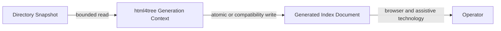
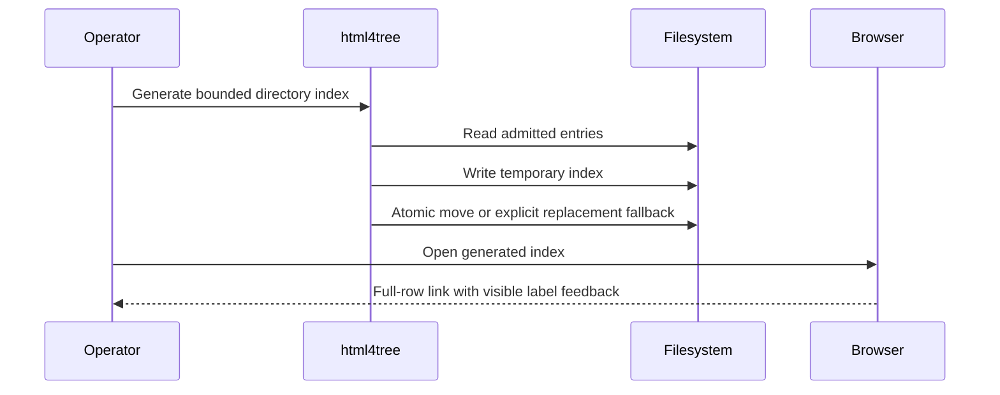

# Product–Technical Gap Baseline

Status: **Proposed**  
Last evidence refresh: 2026-09-27  
Current review: [html4tree#725](https://github.com/ContextualWisdomLab/html4tree/pull/725)  
Evidence ancestor: `978b737c4b889b01b6cd4772dc2f5746ac669601`

## Goal and loop

html4tree converts a bounded directory snapshot into a safe, readable static index. Review the exact PR head, preserve the generated-document contract with tests, run exact-head checks, obtain real-browser and independent evidence, then merge ordinarily. Pending evidence keeps the change Draft/Proposed.

## PRD

A directory entry must remain one full-size link target. Pointer hover and keyboard focus must visibly identify the human-readable entry label without decorating the icon or visually hidden assistive text. Generated pages must preserve file order, empty-state meaning, readable light/dark contrast, reduced-motion behavior, and safe path output.

## TRD

`process_dir` owns generated HTML. `CSS_CONTENT` owns the emitted stylesheet and its CSP hash. Visible file and parent labels use the semantic `entry-label` class; assistive type/context text remains separately `visually-hidden`. `GeneratedIndexReadabilityTest` executes the real generator and inspects emitted HTML/CSS rather than a test-only fixture.

Figma component ID: **none evidenced**. Storybook story: **none evidenced**. The product is generated static HTML; neither artifact is claimed complete.

## Context Map

- Domain truth: the current readable directory snapshot.
- Generator ownership: path admission, ordering, escaping, HTML/CSS emission, write recovery.
- Presentation ownership: generated index semantics and interaction feedback.
- Boundary: generated presentation never becomes filesystem truth.

## UML

## ERD

No database entity or relationship is owned by this product. Input is a filesystem snapshot; output is one generated HTML document per admitted directory. No database persistence is introduced by #725.

## Exact-head acceptance matrix

| Concern | Evidence | Status |
|---|---|---|
| Determinism | Real generated-file tests cover ordering and exact emitted label classes | Source PASS; hosted check pending |
| Semantics | Visible `entry-label` and separate hidden type/context text | Source PASS |
| Accessibility | Focus-visible selector, full-link outline, contrast math, reduced-motion source tests | Partial; browser/AT absent |
| Pointer/touch/keyboard | Hover/focus source contract exists; real pointer, touch, Tab, and activation replay absent | FAIL |
| Responsive | Viewport meta and wrapping exist; 320/768/desktop screenshots absent | FAIL |
| Locales | Generated document is Korean; ko/en/ja/zh/vi/es/de/fr authority and wrapping evidence absent | FAIL |
| Large data | Realistic directory-size generation/render median and p95 absent | FAIL |
| Import/export | Filesystem snapshot to escaped index contract exists | Partial |
| Recovery | Temporary write and atomic/fallback replacement exist; crash/permission/browser reload evidence absent | Partial |
| States | Non-empty and empty states have source tests; loading/error/permission/offline/read-only/stale/conflict/retry/busy applicability is not fully documented | Pending |

## Gap and action ledger

| Gap | Required action | Status |
|---|---|---|
| Hover target regression | Bind CSS to semantic visible labels and test both visible and hidden spans | Repaired; checks pending |
| Browser interaction | Replay hover, focus-visible, Tab/Enter, touch activation, and screen-reader names in current Chromium/Firefox/WebKit | Open |
| Responsive evidence | Capture 320 px, 768 px, and desktop light/dark screenshots with long CJK and expanded labels | Open |
| Locale ownership | Define released ko/en/ja/zh/vi/es/de/fr screen-resource authority or record a bounded product-language decision | Open |
| Performance | Measure realistic large-directory generation and browser render median/p95 without reducing entry count | Open |
| Recovery | Exercise permission failure, replacement fallback, interruption, and reload without stale/partial output | Open |

## Sensitive-extension matching acceptance — html4tree#783

Product source remains single-writer [html4tree#783](https://github.com/ContextualWisdomLab/html4tree/pull/783); this documentation lane records evidence only. Product evidence exact: `70e87db2af253fb158f55e467c6202e6410a094c`.

### PRD / TRD / ownership

The generator must exclude configured sensitive suffixes case-insensitively without hiding ordinary files. One private fixed extension table owns matching. A derived duplicate list is not an external compatibility boundary because `Constants` is file-private. Coverage demonstrates exercised behavior, not speed.

### Exact-head acceptance

| Concern | Evidence | Status |
|---|---|---|
| Semantics | Mixed-case `.pem`, `.key`, and `.p12` exclusion plus safe `.txt` preservation test | Source PASS; hosted pending |
| Single writer | One private array; duplicate derived list removed | Source PASS |
| Performance | No representative directory benchmark, allocation/GC trace, median, or p95 | FAIL |
| Large data | Dataset shape and failure denominator absent | FAIL |
| Import/export/recovery | Generated index exclusion equivalence and reload/crash replay absent | Pending |
| Browser/accessibility/responsive/locales | Inherited generated-page gates above remain incomplete | FAIL |

### Gap / action / status

Keep html4tree#783 Draft/Proposed. Measure the exact directory-crawl path with recorded runtime/hardware, warm-up, sample size, failure denominator, allocations, GC, median, and p95. Do not use JaCoCo coverage as performance evidence. Preserve exact exclusions through generated-file and recovery replay.

## Release decision

Keep html4tree#725 **Draft/Proposed** until exact-head CI/security checks are terminal GREEN, current-head independent approval exists, and applicable browser, accessibility, responsive, locale, performance, and recovery rows pass. No release or GitHub Pages publication is claimed.
