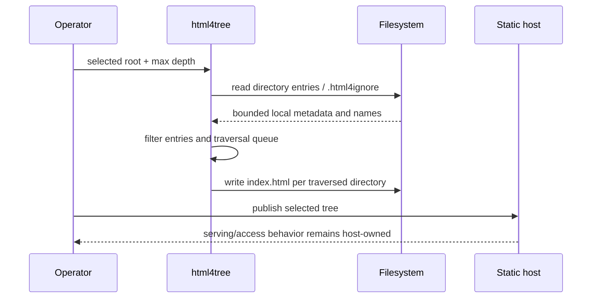

# html4tree product and technical gap baseline

**Snapshot:** 2026-09-02  
**Default-branch base inspected by the README lane:** `master@de82f99f66fc9e190398f9bb1c8c6bd69bd88a30`  
**Audience:** operators, maintainers, security reviewers, and integrators

This ledger records the current product boundary, architecture, inherited licensing, and buyer-visible gaps for `html4tree`. It is dated evidence; mutable pull-request/check state must be re-read before integration.

## Product responsibility

`html4tree` is a Kotlin CLI that crawls a selected directory tree and writes static `index.html` navigation pages. The generated HTML can be served by an ordinary static host.

It does not own HTTP serving, authentication, authorization, TLS, content-retention policy, or the decision that files under a selected root are safe to publish. `.html4ignore` controls generated navigation and recursive crawler traversal, not access control.

## Ubiquitous language and invariants

- **Selected root:** operator-supplied directory from which traversal begins.
- **Generated index:** an `index.html` page written by `html4tree` for a traversed directory.
- **Traversal depth:** the CLI bound controlling how far recursive index generation proceeds.
- **Ignore rule:** a bounded Java filesystem glob read from `.html4ignore` and matched against an entry name.
- **Ignored directory:** a matching directory omitted from its parent listing and not enqueued for recursive index generation; the underlying directory remains on disk and can still be served directly by a static host.
- **Publication authority:** explicitly outside this repository. Presence or absence from generated navigation never grants or revokes file access.
- **Generated-output cleanup:** an operator responsibility; a broad filesystem deletion command cannot distinguish a pre-existing `index.html` from one generated by this tool unless the operator provides separate provenance.

## Context Map

```text
operator / build pipeline
        |
        | selected filesystem root + CLI options
        v
+----------------------------+
| html4tree                  |
| crawl -> filter -> render  |
| -> write static indexes    |
+----------------------------+
        |
        | generated index.html files
        v
static hosting / deployment system
        |
        v
browser / reader
```

The filesystem remains the source of directory/file truth. The static host remains the authority for delivery and access policy. `html4tree` owns only deterministic index generation from the selected local tree.

## Product flow UML



## Data / ERD boundary

`html4tree` has no repository-owned database, persistent service state, or domain tables. A database ERD is therefore not applicable and would invent an authority boundary that does not exist. Source filesystem objects and generated static files are the relevant state surfaces.

## Architecture and verification evidence

The current repository uses Kotlin and Clikt with a checked-in Gradle 5.1.1 wrapper. The documented source path requires JDK 8–11 with this toolchain. `./gradlew check` is the repository verification entry point; the build configuration includes JaCoCo coverage verification with a 100% minimum threshold for measured code.

The README lane preserves the existing MIT license and its original `Copyright (c) 2019 Yamir Encarnacion` attribution. GitHub metadata identifies `ContextualWisdomLab/html4tree` as a fork of `yencarnacion/html4tree`, whose repository is also MIT-licensed. ContextualWisdomLab maintenance does not replace that inherited attribution or relicense third-party build/runtime dependencies.

The ContextualWisdomLab fork currently has no GitHub Release. Source state and passing checks must not be presented as an immutable release artifact.

## Gap register

| Priority | Gap | Evidence / risk | Required action | Status |
| --- | --- | --- | --- | --- |
| P0 | Active security PR queue is fragmented across overlapping fixes | Multiple current PRs address `.html4ignore` TOCTOU/read failures and path-input hardening on separate branches | Reconcile by root cause and verified delta carryover into canonical security writers; preserve tests and retire only proven-complete duplicates | **Open** |
| P1 | Current Gradle/JDK toolchain is legacy | Gradle 5.1.1 requires JDK 8–11 for the documented path, limiting supported developer/runtime environments | Upgrade Gradle/Kotlin/dependency toolchain through an explicit compatibility/security test lane; verify generated HTML/CLI behavior and coverage before changing README support claims | **Open** |
| P1 | Generated files lack explicit provenance for safe cleanup | Operator cleanup can remove pre-existing `index.html` files because generated output is not distinguishable by durable provenance | Design a backwards-compatible provenance/manifest or safe cleanup command before advertising automated cleanup | **Open** |
| P1 | Publication/access control is intentionally external but easy to misunderstand | `.html4ignore` can hide navigation while direct static-host access remains possible | Keep fail-closed README/security language and add integration tests/examples for representative static-host deployment boundaries if a supported deployment profile is introduced | **Documented boundary** |
| P1 | No immutable ContextualWisdomLab release | GitHub release inventory is empty | Establish reproducible release/package checks, checksum/SBOM/provenance as appropriate, then publish only from one protected exact source revision | **Not release-ready** |
| P2 | Canonical product documentation was previously sparse | README PR #600 now owns task-first README and Pages-ready landing | Keep README, this ledger, and actual CLI/build semantics synchronized; avoid branch/run details in customer-facing copy | **In progress on #600** |

## Current documentation integration lane

PR #600 is the canonical README/public-documentation writer. It owns `README.md`, `docs/index.md`, and this gap baseline. Review repairs already align `.html4ignore` recursion semantics, the real Gradle `build` task, JDK 8–11 constraints, and Pages-safe repository navigation.

Every mutation of the writer branch invalidates prior exact-head check evidence. Before ordinary integration, re-read the unchanged final head, live `master`, reviews/threads, repository CI, SAST/Security, mergeability, and then-live governance.

## Documentation / architecture gaps

The repository currently does not expose a canonical PRD/TRD/ADR/ARCHITECTURE set. For a small CLI this does not justify manufacturing a large document tree, but any future change that alters product responsibility, generated-file authority, security boundary, supported toolchain, or publication integration should record the decision in an appropriately scoped ADR/architecture document and update this ledger.

## Update rule

Update this file when protected product behavior, CLI/build support, security authority, inherited licensing/provenance, release state, or a gap status changes. Mutable PR/check identifiers may be used as dated evidence but never as permanent product truth.
